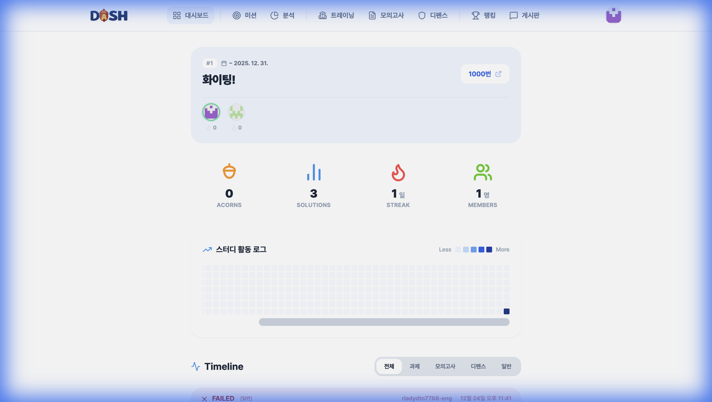
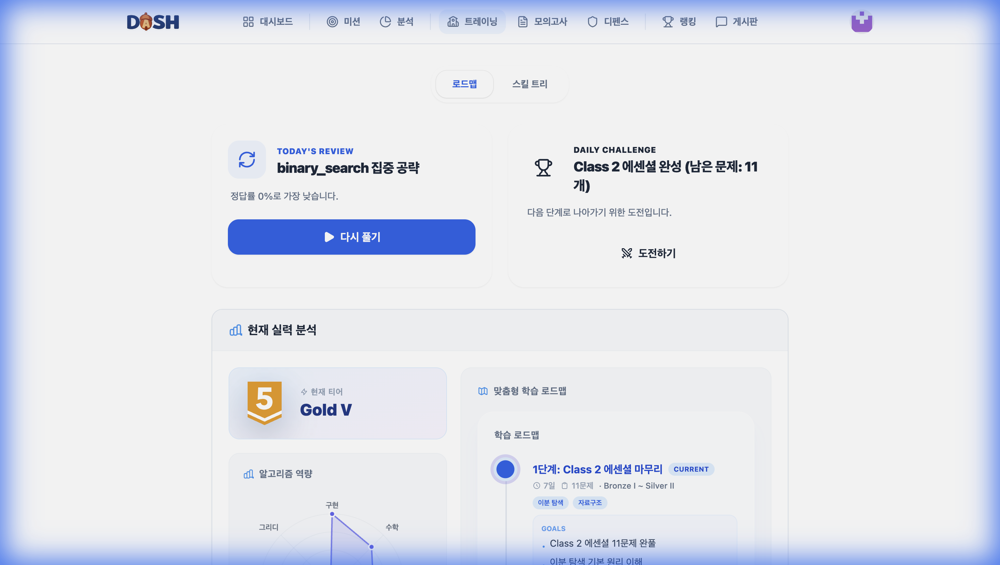
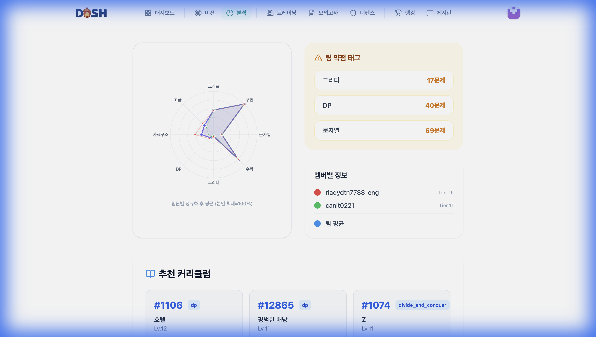
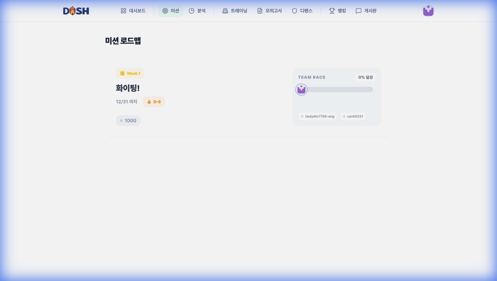
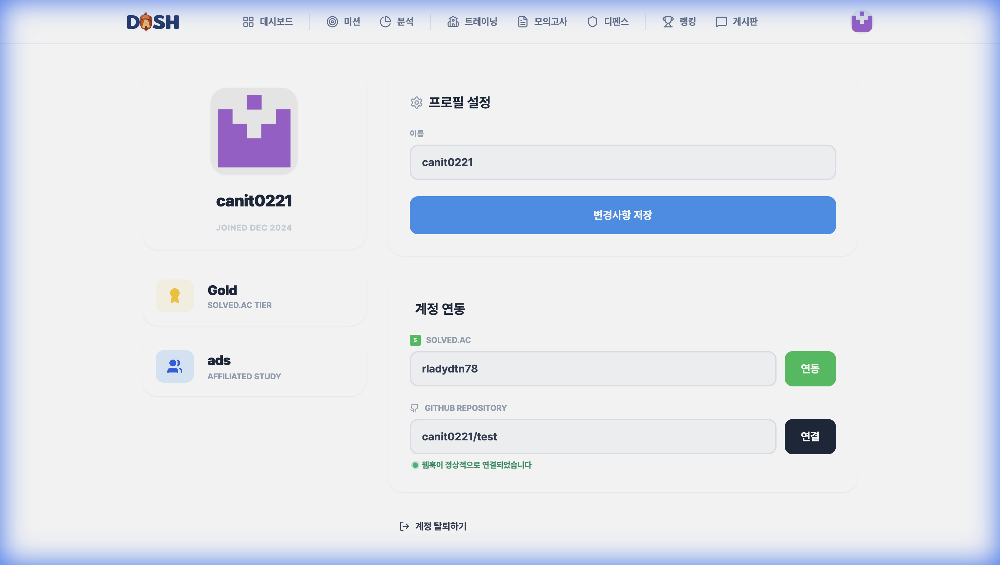
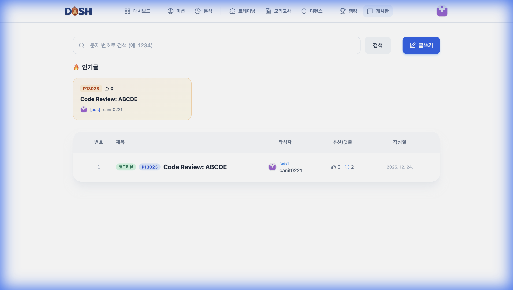

# 📸 DASH 실행 화면

DASH 알고리즘 학습 플랫폼의 주요 화면 스크린샷입니다.

---

## 1. 📊 Dashboard (대시보드)

개인 알고리즘 풀이 기록과 AI 분석 결과를 확인할 수 있는 메인 화면입니다.

**주요 기능:**
- Timeline 형식의 풀이 기록 목록
- 통계 (도토리, 솔루션 수, 연속 스트릭, 멤버 수)
- AI 코드 분석 및 리뷰
- 핵심 로직 하이라이팅

---

## 2. 🎯 Training Center (트레이닝 센터)

개인 맞춤형 학습 로드맵과 스킬 트리를 제공하는 훈련 센터입니다.

**주요 기능:**
- AI 기반 학습 로드맵 생성
- 스킬 트리 시각화
- 강약점 분석
- 추천 문제 제공

---

## 3. 📈 Team Analysis (팀 분석)

스터디 팀의 역량을 분석하고 시각화하는 화면입니다.

**주요 기능:**
- 레이더 차트로 팀원별 역량 비교
- 팀 약점 태그 분석
- 맞춤 커리큘럼 추천
- 미션 자동 등록 기능

---

## 4. 🏁 Study Missions (스터디 미션)

스터디 미션을 관리하고 팀원들의 진행 상황을 추적하는 화면입니다.

**주요 기능:**
- 미션 로드맵 시각화
- Team Race 실시간 진행률 추적
- 미션별 상세 정보 및 문제 목록
- 팀원 완료 현황 확인

---

## 5. 👤 Profile (프로필)

사용자 정보와 계정 연동 설정을 관리하는 화면입니다.

**주요 기능:**
- Solved.ac 티어 정보
- GitHub 계정 연동
- Solved.ac 핸들 연동
- 프로필 이미지 관리

---

## 6. 📝 Mock Exam (모의고사)

실전 연습을 위한 모의고사 기능입니다.

**주요 기능:**
- 시간 제한 모의고사
- 난이도별 문제 선택
- 실전 환경 시뮬레이션

---

## 7. 🛡️ Random Defense (랜덤 디펜스)

랜덤 문제 도전 모드로 실력을 테스트하는 화면입니다.

**주요 기능:**
- 난이도별 랜덤 문제 도전
- 연승 기록 추적
- 제한 시간 내 문제 풀이

---

## 8. 💬 Community Board (게시판)

스터디원들과 소통할 수 있는 커뮤니티 게시판입니다.

**주요 기능:**
- 인기 게시글 하이라이트
- 게시글 검색 및 필터링
- 스터디 공지사항 관리

